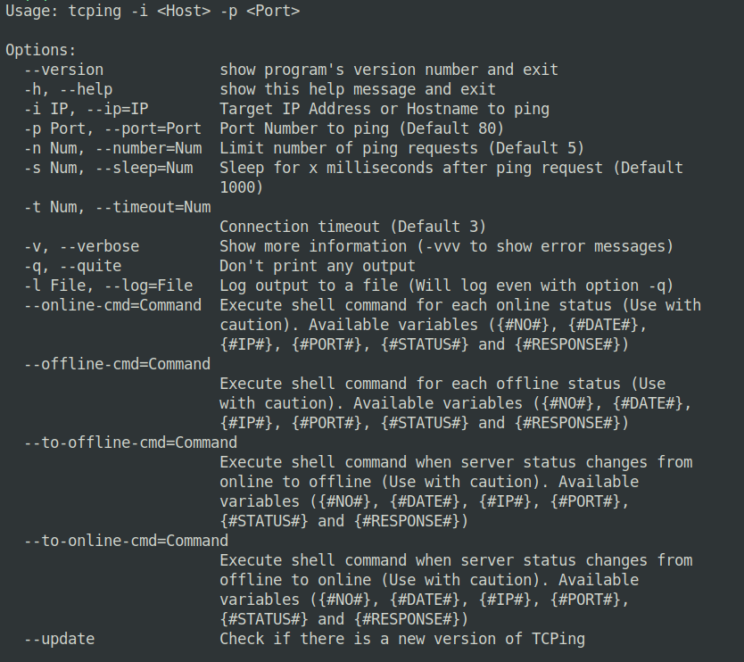

### TCPing (v0.1.3 Beta)
TCPing is a tool that allows you to use a TCP connection to ping a service. It can be used as a replacement of ICMP Ping in case the network doesn't allow ICMP, or as a service live check.

This is a beta release, so please open an issue if you notice an issue.

The tools is written in Python3 and it needs Python v3 to be installed.



-------
### Install (Linux)
Simply clone the repository to the location you want:
(Example: you want to place it in `~/apps/`
```Bash
mkdir -p ~/apps/
cd ~/apps/
git clone https://github.com/ayoobali/TCPing
cd TCPing
chmod ug+x tcping.py
python3 tcping.py -h
```

*To run the application from any directory, just create a symlink of `tcping` in your bin directory.*

```Bash
ln -s ~/apps/TCPing/tcping.py ~/bin/tcping
```


OR One line installation:

```bash
mkdir -p ~/apps/ && cd ~/apps/ && git clone https://github.com/ayoobali/TCPing && cd TCPing && chmod gu+x tcping.py && ln -s ~/apps/TCPing/tcping.py ~/bin/tcping
```


-------
### Usage
To ping a service:
```Bash
tcping -i <hostname> -p <port>
```

To save the response time of a server once every hour for 24 hours:
```Bash
tcping -i example.com -p 443 -n 24 -s 3600000 -q --online-cmd "echo '{#DATE#},{#RESPONSE#}' >> data.csv" &
```
This will run the command in the background and it will create a file called `data.txt` with the timestamp and response time for the next 24 hours

To show the output of `--online-cmd` and `--offline-cmd` commands use `-vv`

For more options type `tcping -h`


-------
### ToDo:

 - Send HTTP request when target status changes (Online/Offline).
 - Run shell command when target status changes from online to offline and vice versa.
 - ~~Run shell command if target is Offline.~~
 - ~~Run shell command if target is Online.~~ 


-------
### License

This tool is released under MIT License.


-------
### Change Log:

[2019-01-31] v0.1.3 (Beta):.
 - [Add] Added option `--online-cmd` that allows execution of shell commands for each online status.
 - [Add] Added option `--offline-cmd` that allows execution of shell commands for each offline status.
 - [Mod] Modified the option `-n` and `--number` to allow the value `0` for infinite ping requests.
 - [Mod] Modified the sleep function to sleep after each request instead of before each request.

   Note: in the options `--online-cmd` and `--offline-cmd` you can use the following variables to be automatically replaced.
        `{#NO#}`, `{#DATE#}`, `{#IP#}`, `{#PORT#}`, `{#STATUS#}` and `{#RESPONSE#}`
        Example: `tcping -i example.com -p 443 -n 0 -s 10000 -q --offline-cmd 'notify-send "TCPing" "IP: {#IP#} is {#STATUS#}\nOn Port: {#PORT#}\nAt: {#DATE#}"'`

[2019-01-27] v0.1.2 (Beta):
 - [Fix] Fixed an issue that `--sleep`, `--timeout` and `--number` were throwing an error.
 
[2019-01-27] v0.1.1 (Beta):
 - [Fix] Fixed an error that `sys` and `os` were used but not imported.
 - [Fix] Fixed wrong License Label in source code file.

[2019-01-26] v0.1 (Beta):
 - First Beta Release.
